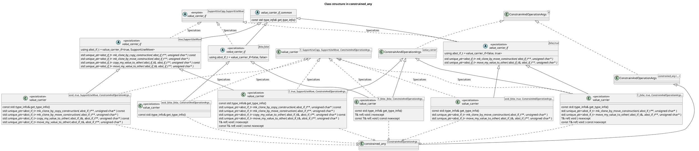

```plantuml
@startuml
title Class structure in constrained_any

' 厳密な型一致の下で動作する機能を構成する基本クラス
abstract value_carrier_if_common {
    {abstract} const std::type_info& get_type_info()
}

abstract value_carrier_if<SupportUseCopy,SupportUseMove>  <<template>> 
abstract "value_carrier_if<true,SupportUseMove>" as value_carrier_if_true_SupportUseMove <<specialization>> {
    using abst_if_t = value_carrier_if<true, SupportUseMove>

	{abstract}  std::unique_ptr<abst_if_t> mk_clone_by_copy_construction( abst_if_t**, unsigned char* ) const
	{abstract}  std::unique_ptr<abst_if_t> mk_clone_by_move_construction( abst_if_t**, unsigned char* )
	{abstract}  std::unique_ptr<abst_if_t> copy_my_value_to_other( abst_if_t&, abst_if_t**, unsigned char* ) const
	{abstract}  std::unique_ptr<abst_if_t> move_my_value_to_other( abst_if_t&, abst_if_t**, unsigned char* )

}
abstract "value_carrier_if<false,true>" as value_carrier_if_false_true <<specialization>> {
	using abst_if_t = value_carrier_if<false, true>

	{abstract}  std::unique_ptr<abst_if_t> mk_clone_by_move_construction( abst_if_t**, unsigned char* )
	{abstract}  std::unique_ptr<abst_if_t> move_my_value_to_other( abst_if_t&, abst_if_t**, unsigned char* )
}
abstract "value_carrier_if<false,false>" as value_carrier_if_false_false <<specialization>> {
	using abst_if_t = value_carrier_if<false, false>
}

value_carrier_if <|.. value_carrier_if_true_SupportUseMove : Specializes
value_carrier_if <|.. value_carrier_if_false_true : Specializes
value_carrier_if <|.. value_carrier_if_false_false : Specializes
value_carrier_if_common <|-- value_carrier_if_true_SupportUseMove
value_carrier_if_common <|-- value_carrier_if_false_true
value_carrier_if_common <|-- value_carrier_if_false_false

class value_carrier<T, SupportUseCopy, SupportUseMove, ConstrainAndOperationArgs...>
class "value_carrier<void, true, SupportUseMove, ConstrainAndOperationArgs...>" as value_carrier_void_true_SupportUseMove_ConstrainAndOperationArgs <<specialization>> {
    const std::type_info& get_type_info()
	std::unique_ptr<abst_if_t> mk_clone_by_copy_construction( abst_if_t**, unsigned char* ) const
	std::unique_ptr<abst_if_t> mk_clone_by_move_construction( abst_if_t**, unsigned char* )
	std::unique_ptr<abst_if_t> copy_my_value_to_other( abst_if_t&, abst_if_t**, unsigned char* ) const
	std::unique_ptr<abst_if_t> move_my_value_to_other( abst_if_t&, abst_if_t**, unsigned char* )
}
class "value_carrier<void, false, true, ConstrainAndOperationArgs...>" as value_carrier_void_false_true_ConstrainAndOperationArgs <<specialization>> {
    const std::type_info& get_type_info()
	std::unique_ptr<abst_if_t> mk_clone_by_move_construction( abst_if_t**, unsigned char* )
	std::unique_ptr<abst_if_t> move_my_value_to_other( abst_if_t&, abst_if_t**, unsigned char* )
}
class "value_carrier<void, false, false, ConstrainAndOperationArgs...>" as value_carrier_void_false_false_ConstrainAndOperationArgs <<specialization>> {
    const std::type_info& get_type_info()
}
class "value_carrier<T, true, SupportUseMove, ConstrainAndOperationArgs...>" as value_carrier_T_true_SupportUseMove_ConstrainAndOperationArgs <<specialization>> {
    const std::type_info& get_type_info()
	std::unique_ptr<abst_if_t> mk_clone_by_copy_construction( abst_if_t**, unsigned char* ) const
	std::unique_ptr<abst_if_t> mk_clone_by_move_construction( abst_if_t**, unsigned char* )
	std::unique_ptr<abst_if_t> copy_my_value_to_other( abst_if_t&, abst_if_t**, unsigned char* ) const
	std::unique_ptr<abst_if_t> move_my_value_to_other( abst_if_t&, abst_if_t**, unsigned char* )
	T& ref( void ) noexcept
	const T& ref( void ) const noexcept
}
class "value_carrier<T, false, true, ConstrainAndOperationArgs...>" as value_carrier_T_false_true_ConstrainAndOperationArgs <<specialization>> {
    const std::type_info& get_type_info()
	std::unique_ptr<abst_if_t> mk_clone_by_move_construction( abst_if_t**, unsigned char* )
	std::unique_ptr<abst_if_t> move_my_value_to_other( abst_if_t&, abst_if_t**, unsigned char* )
	T& ref( void ) noexcept
	const T& ref( void ) const noexcept
}
class "value_carrier<T, false, false, ConstrainAndOperationArgs...>" as value_carrier_T_false_false_ConstrainAndOperationArgs <<specialization>> {
    const std::type_info& get_type_info()
	T& ref( void ) noexcept
	const T& ref( void ) const noexcept
}

value_carrier <|.. value_carrier_void_true_SupportUseMove_ConstrainAndOperationArgs : Specializes
value_carrier <|.. value_carrier_void_false_true_ConstrainAndOperationArgs : Specializes
value_carrier <|.. value_carrier_void_false_false_ConstrainAndOperationArgs : Specializes
value_carrier <|.. value_carrier_T_true_SupportUseMove_ConstrainAndOperationArgs : Specializes
value_carrier <|.. value_carrier_T_false_true_ConstrainAndOperationArgs : Specializes
value_carrier <|.. value_carrier_T_false_false_ConstrainAndOperationArgs : Specializes
value_carrier_if_true_SupportUseMove <|-- value_carrier_void_true_SupportUseMove_ConstrainAndOperationArgs
value_carrier_if_false_true <|-- value_carrier_void_false_true_ConstrainAndOperationArgs
value_carrier_if_false_false <|-- value_carrier_void_false_false_ConstrainAndOperationArgs
value_carrier_if_true_SupportUseMove <|-- value_carrier_T_true_SupportUseMove_ConstrainAndOperationArgs
value_carrier_if_false_true <|-- value_carrier_T_false_true_ConstrainAndOperationArgs
value_carrier_if_false_false <|-- value_carrier_T_false_false_ConstrainAndOperationArgs

class ConstrainAndOperationArgs<X>
class "ConstrainAndOperationArgs<value_carrier>" as ConstrainAndOperationArgs_value_carrier
class "ConstrainAndOperationArgs<constrained_any<...>>" as ConstrainAndOperationArgs_constrained_any

ConstrainAndOperationArgs <|.. ConstrainAndOperationArgs_value_carrier
ConstrainAndOperationArgs <|.. ConstrainAndOperationArgs_constrained_any

ConstrainAndOperationArgs_value_carrier <|-- value_carrier_T_true_SupportUseMove_ConstrainAndOperationArgs
ConstrainAndOperationArgs_value_carrier <|-- value_carrier_T_false_true_ConstrainAndOperationArgs
ConstrainAndOperationArgs_value_carrier <|-- value_carrier_T_false_false_ConstrainAndOperationArgs

class constrained_any<ConstrainAndOperationArgs...>

ConstrainAndOperationArgs_constrained_any <|-- constrained_any

value_carrier_void_true_SupportUseMove_ConstrainAndOperationArgs ..o constrained_any
value_carrier_void_false_true_ConstrainAndOperationArgs ..o constrained_any
value_carrier_void_false_false_ConstrainAndOperationArgs ..o constrained_any
value_carrier_T_true_SupportUseMove_ConstrainAndOperationArgs ..o constrained_any
value_carrier_T_false_true_ConstrainAndOperationArgs ..o constrained_any
value_carrier_T_false_false_ConstrainAndOperationArgs ..o constrained_any


@enduml
```
